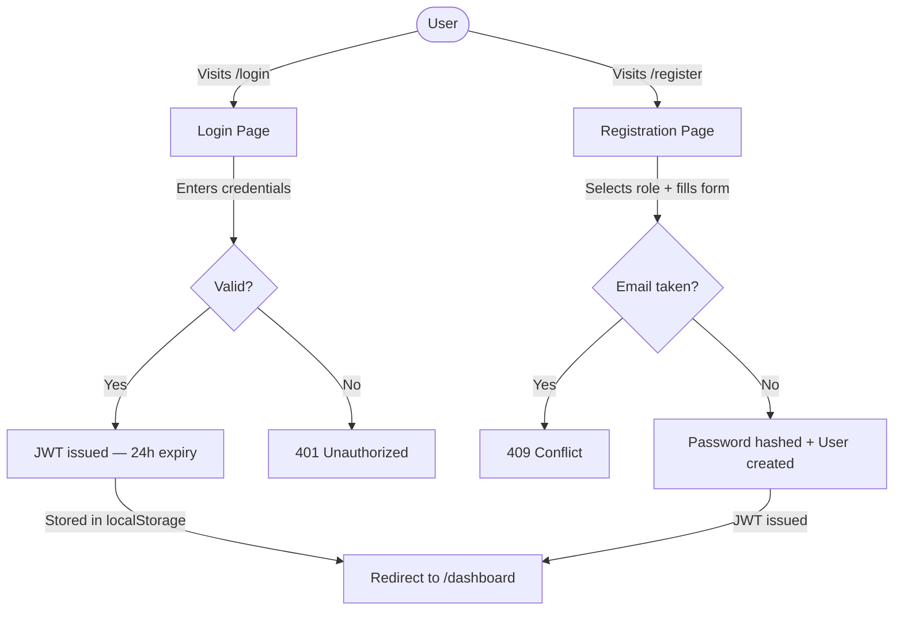
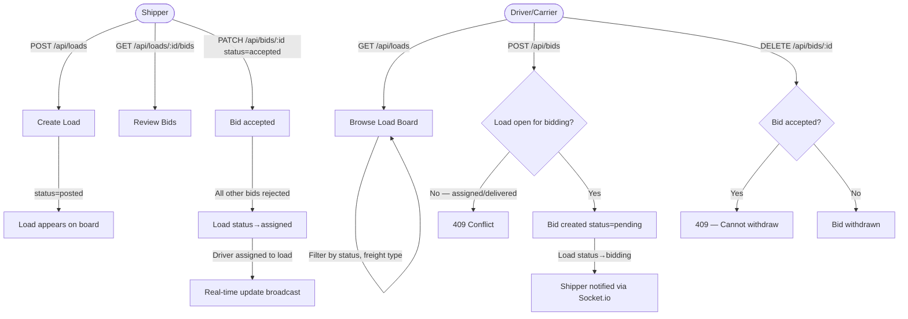
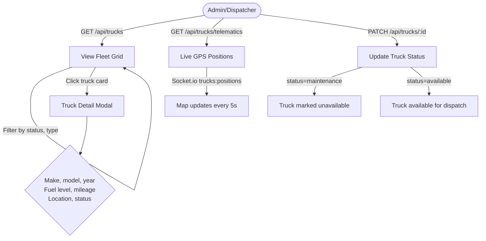
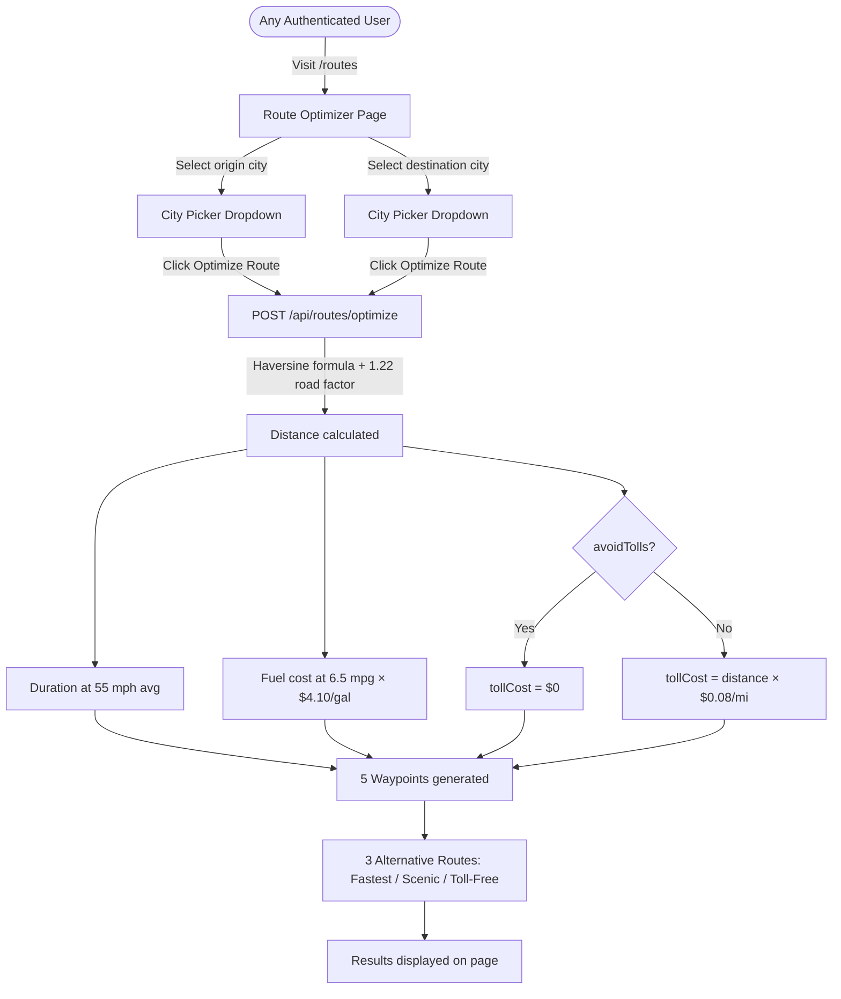
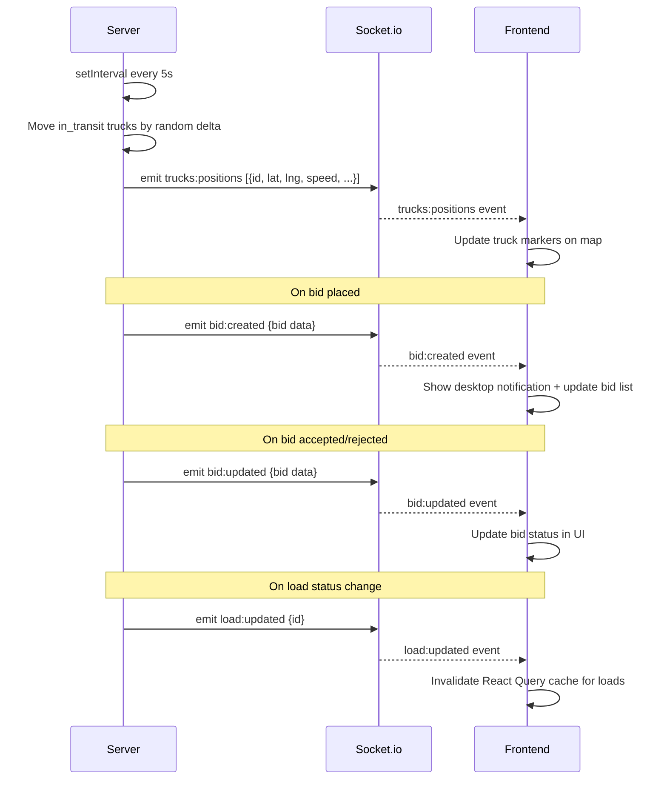
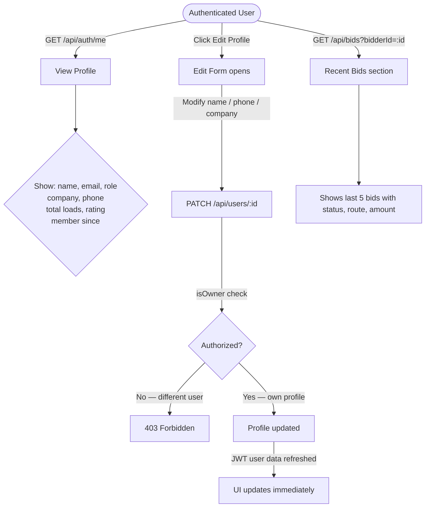
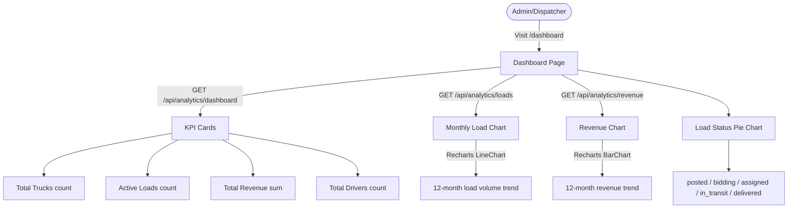
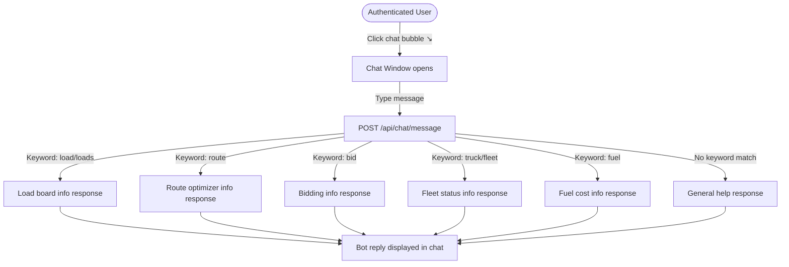

# TruckLink — Use Case Diagrams

## System Actors

| Actor | Role | Key Capabilities |
|---|---|---|
| **Admin** | Platform administrator | Full access to all resources, accept/reject bids, manage users/trucks |
| **Dispatcher** | Operations coordinator | View all loads/trucks, accept/reject bids, optimize routes |
| **Shipper** | Posts freight loads | Create/edit loads, accept/reject bids on own loads |
| **Carrier** | Fleet operator | Place bids on loads, view fleet, optimize routes |
| **Driver** | Operates trucks | Place bids on loads, view assigned loads, track routes |

---

## UC-01: User Authentication

---

## UC-02: Load Board & Bidding

---

## UC-03: Fleet Management

---

## UC-04: Route Optimization

---

## UC-05: Real-Time Updates (Socket.io)

---

## UC-06: User Profile Management

---

## UC-07: Analytics Dashboard

---

## UC-08: Chatbot Assistant

